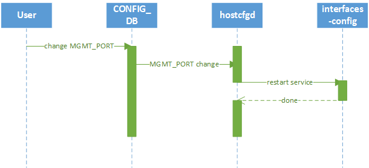

# SONiC Management Interface Configuration High Level Design

# Table of Contents
<!-- TOC -->

- [Revision history](#revision-history)
- [Scope](#scope)
- [1 Requirements](#1-requirements)
- [2 Schema design](#2-schema-design)
  - [2.1 Configuration](#21-configuration)
    - [2.1.1 config\_db.json](#211-config_dbjson)
    - [2.1.2 CONFIG\_DB](#212-config_db)
  - [2.2 APPL\_DB](#22-appl_db)
  - [2.3 STATE\_DB](#23-state_db)
  - [2.4 SAI](#24-sai)
  - [2.5 Sonic Host Service](#25-sonic-host-service)
    - [2.5.1 Host config daemon hostcfgd](#251-host-config-daemon-hostcfgd)
    - [2.5.2 Interface-config service](#252-interface-config-service)
- [3 Event flow diagrams](#3-event-flow-diagrams)
  - [3.1 Management port configuration change](#31-management-port-configuration-change)
- [4 CLIs](#4-clis)
- [5 Warm reboot support](#5-warm-reboot-support)
- [6 Unit test](#6-unit-test)
  - [6.1 hostcfgd\_test](#61-hostcfgd_test)
- [7 Performance](#7-performance)
- [8 Upgrade and Downgrade considerations](#8-upgrade-and-downgrade-considerations)

<!-- /TOC -->

# Revision history
| Rev |    Date     |       Author       | Change Description                                      |
|:---:|:-----------:|:------------------:|---------------------------------------------------------|
| 0.1 | 31/10/2023  | Chris Yang         | Initial version                                         |
|     |             |                    |                                                         |

# Scope
This design focuses on the backend configuration settings for management interfaces. The settings are speed, duplex and auto-negotiation in the document. And it can be easily extended to more settings.
The document does not include the front-end CLI for the related settings.

# 1 Requirements

The backend capacity of the following configuration settings for management interfaces:
* Interface speed
* Interface duplex
* Interface auto-negotiation

# 2 Schema design

A new table "MGMT_PORT" in the CONFIG_DB will be added to host the settings of a management interface.
APPL_DB and STATE_DB will not be used.

## 2.1 Configuration
### 2.1.1 config_db.json
```
"MGMT_PORT": {
    "{{ mgmt_intf }}": {
        'autoneg': 'on' or 'off',
        'duplex': 'full' or 'half',
        'speed': <speed in Mb/s>
    }
},
```
A key in the MGMT_PORT table is the name of a management interface, for example, "eth0".

* 'autoneg' field is the auto-negotiation setting of a interface. The value is either "on" or "off".
* 'duplex' field is the duplex setting of a interface. The value is either "full" or "half".
* 'speed' field is the speed of a interface in Mb/s.

Example configuration:
```
"MGMT_PORT": {
    "eth0": {
        'autoneg': 'on',
        'duplex': 'full',
        'speed': '1000'
    }
},
```

### 2.1.2 CONFIG_DB
```
MGMT_PORT|{{ mgmt_intf }}
    "autoneg" : 'on' or 'off'
    "duplex" : 'full' or 'half'
    "speed" : <speed in Mb/s>
```

## 2.2 APPL_DB
N/A

## 2.3 STATE_DB
N/A

## 2.4 SAI
N/A

## 2.5 Sonic Host Service
### 2.5.1 Host config daemon hostcfgd

Host config daemon hostcfgd responds to monitor and apply management interface related configuration.
The feature extends hostcfgd to monitor the new MGMT_PORT table in CONFIG_DB.
If the table changes, it will restart interfaces-config service to apply the change.

### 2.5.2 Interface-config service

Interface-config service responds to apply the management interface related configurations.
The feature extends interface-config service to apply the management port configuration.
The management port configuration will be applied by 'ethtool' package.

For example,
```
ethtool -s eth0 speed 1000 duplex full autoneg off
```

# 3 Event flow diagrams
## 3.1 Management port configuration change


* hostcfgd subscribes MGMT_PORT config changes.
* interfaces-config service will be restarted to apply the change.

# 4 CLIs
The feature is a backend feature without CLI support.

# 5 Warm reboot support
N/A

# 6 Unit test
## 6.1 hostcfgd_test
The exist test case test_mgmtiface_event will be extended to cover the MGMT_PORT table change.

# 7 Performance
The time cost of 'ethtool' running is 0.08s to 0.21s on Intel I219-LM NIC.

# 8 Upgrade and Downgrade considerations
N/A
